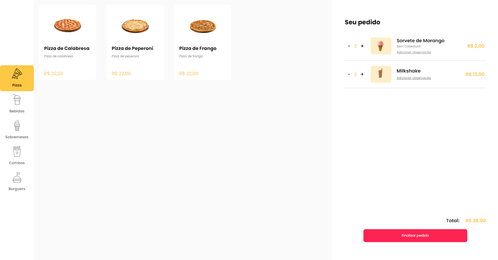
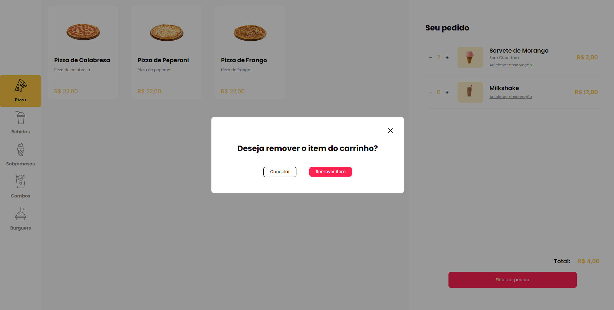
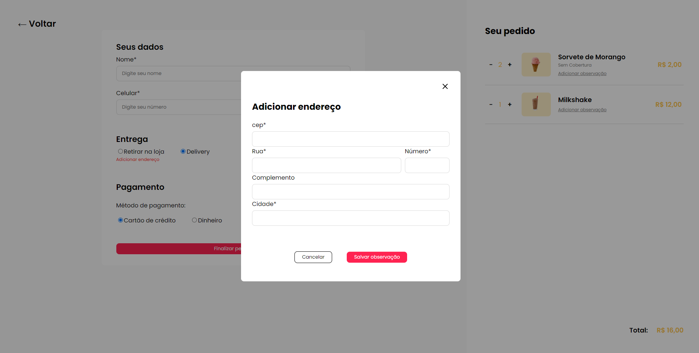
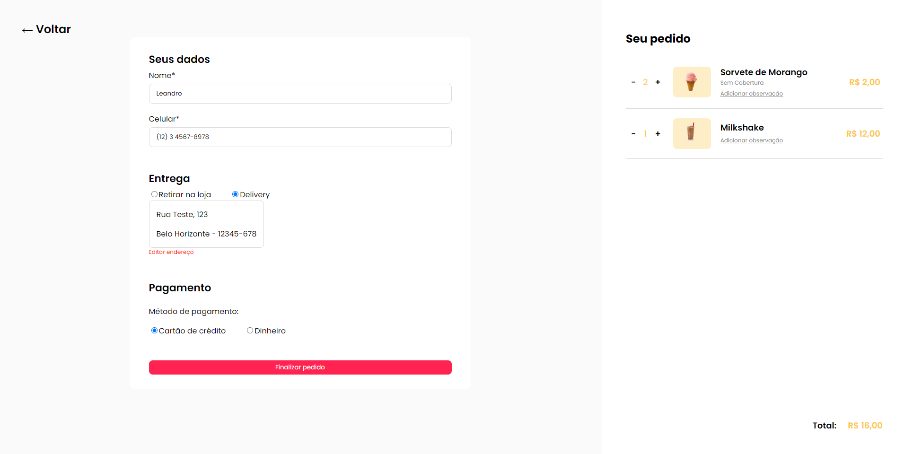
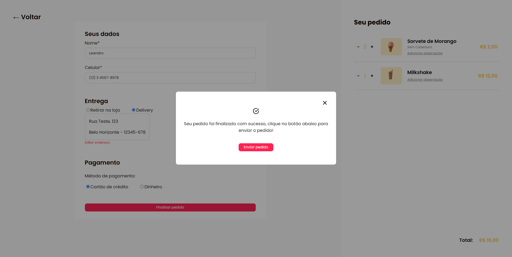

# 🍔 Delivery Website 


## 📋 Summary

- <a href="#project-description">Project description</a>
- <a href="#funcionality">Funcionality</a>
- <a href="#Layout">Layout</a>
- <a href="#Technologies">Technologies</a>
- <a href="#Coming-soon">Coming soon</a>
- <a href="#Project-setup">Project setup</a>


<h2 id='project-description'>✏️ Project description</h2>

This is a delivery website. 
In the website, user can select a product and add products to cart.
After adding the products the user wants, it is possible to finalize the order, enter delivery address information, and send all the information to a restaurant's whatsapp number.


<h2 id='Funcionality'>⏩ Funcionality</h2>

- Select products, add to cart and remove from cart
- Increase and Decrease products quantities
- User data, Delivery and Payment type form
- Zip Code API for autocompletion
- Warning and Success modal
- Send order to whatsapp number

<h2 id='Layout'>📷 Layout</h2>








<h2 id='Technologies'>💻 Technologies</h2>

- HTML, CSS, JavaScript
- Vue.js
- Vuex
- Vue router

<h2 id='Coming-soon'>⏰ Coming soon</h2>

- Login and Authentication system

<h2 id='Project-setup'>✔️ Project setup</h2>

### Required
```
npm install
npm install -g json-server
```

### Project clone
```
git clone https://github.com/leandroasalles/restaurant.git
```
### Start JSON server
```
json-server --watch db.json
```
### Compiles
```
npm run serve
```

